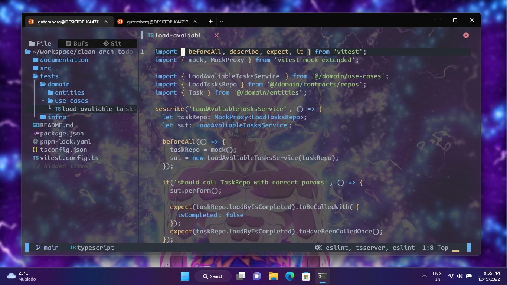

<h1 align="center">Gutinho Tech Astrovim</h1>

## 🧪 Features

This setup contains the following configurations:

* Transparent background
* Eslint format on save

## 🚀 How to use
First install astrovim:
```bash
 git clone https://github.com/AstroNvim/AstroNvim ~/.config/nvim
```
Then download the user configuration and execute the nvim command:
```bash
  git clone https://github.com/gutemberg-jhonata/gutinho-tech-nvim.git ~/.config/nvim/lua/user
  nvim
```
Finaly install the typescript and eslint lsp server:
```bash
  :LspInstall typescript
  :LspInstall eslint 
```

## 💻 About

This is a setup with my preferred working configuration for Astrovim IDE.
In the picture below, you can see how your nvim will looks like. 👇

<p align="center">
  
</p>

## :memo: Licence

This project is under MIT license. See the [LICENSE](.github/LICENSE.md) file for more details.
